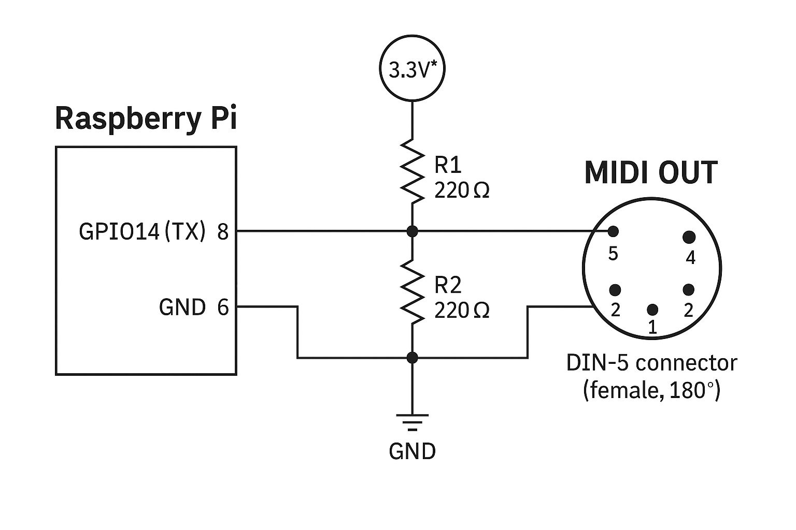
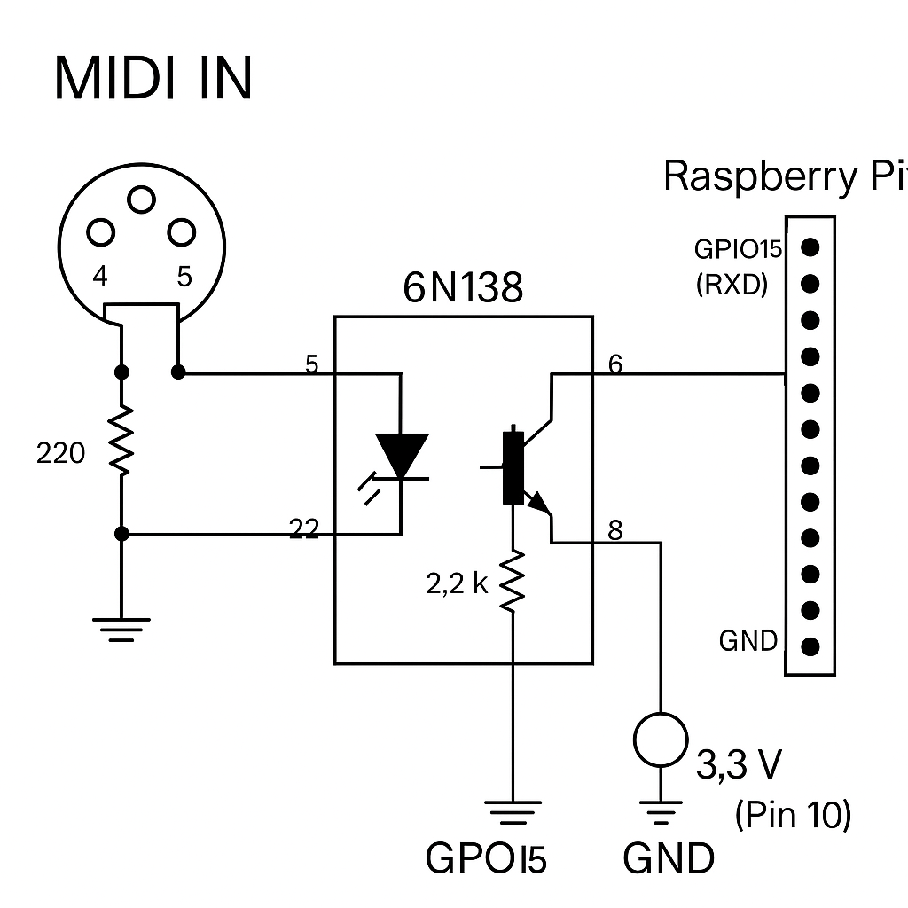

# Bento TTYMIDI

bento_ttymidi is a lightweight MIDI bridge that connects ALSA MIDI with UART MIDI hardware. It supports both sending (TX via GPIO14) and receiving (RX via GPIO15) standard 5-pin DIN MIDI messages. Designed for Raspberry Pi systems.

---

## ✅ Features

- ALSA MIDI input to UART MIDI output (31250 baud)
- Supports Note On, Note Off, Control Change, Program Change, Pitch Bend, SysEx
- Optional debug output (`--debug`)
- Can run as a `systemd` service on boot

---

## 🚀 Installation

### 1. Clone the repository

```bash
git clone https://github.com/yourname/bento_ttymidi.git
cd bento_ttymidi
```

### 2. Build the binary

```bash
gcc bento_ttymidi.c -o bento_ttymidi -lasound -lpthread
```

### 3. Install the binary system-wide

```bash
sudo cp bento_ttymidi /usr/local/bin/
sudo chmod +x /usr/local/bin/bento_ttymidi
```

---

## 🧪 Usage

### Manual start with debug output:

```bash
bento_ttymidi --debug
```

### Manual start silently:

```bash
bento_ttymidi
```

---

## 🔁 Autostart on Boot (Systemd)

To run `bento_ttymidi` as a background service at boot:

### 1. Create a systemd service file

```bash
sudo nano /etc/systemd/system/bento_ttymidi.service
```

Paste the following:

```ini
[Unit]
Description=Bento UART MIDI bridge (bento_ttymidi)
After=sound.target dev-serial0.device
Requires=dev-serial0.device

[Service]
ExecStart=/usr/local/bin/bento_ttymidi
Restart=always
User=pi
Group=pi

[Install]
WantedBy=multi-user.target
```

> 💡 If you want to enable debug mode, add `--debug` to `ExecStart`

### 2. Enable and start the service

```bash
sudo systemctl daemon-reexec
sudo systemctl daemon-reload
sudo systemctl enable bento_ttymidi.service
sudo systemctl start bento_ttymidi.service
```

### 3. Check service status

```bash
systemctl status bento_ttymidi.service
```

---

## ⚙️ Raspberry Pi UART Configuration (`config.txt`)

To enable UART MIDI on Raspberry Pi GPIO14 (TX), edit the config.txt:

```bash
sudo nano /boot/config.txt
```

### Add or ensure the following lines are present:

```ini
enable_uart=1
dtoverlay=disable-bt
dtoverlay=midi-uart0
```

After editing, reboot your system:

```bash
sudo reboot
```

You should now see `/dev/serial0` → usually linked to `/dev/ttyAMA0`

---

## 🧩 MIDI Hardware Diagrams

### MIDI OUT Circuit

This diagram shows how to connect the Raspberry Pi UART TX (GPIO14) to a standard 5-pin DIN MIDI OUT interface.



---

### MIDI IN Circuit (for completeness)

This optional MIDI IN circuit allows receiving MIDI via UART RX (GPIO15) using an optocoupler (e.g. 6N138).



---

## 🔗 Creating a persistent /dev/serial0 symlink (if missing)

In some Raspberry Pi systems, `/dev/serial0` may not be automatically created at boot.

To create it permanently (linking to `/dev/ttyAMA0`), add a custom udev rule:

```bash
sudo nano /etc/udev/rules.d/99-serial0.rules
```

Paste this line:

```udev
KERNEL=="ttyAMA0", SYMLINK+="serial0"
```

Then apply the rule:

```bash
sudo udevadm control --reload-rules
sudo udevadm trigger
```

After a reboot, `/dev/serial0` should be available.

---

## 📄 License

MIT (or define your own)

---

## ✉️ Contact

Created by [Your Name] – for use with Raspberry Pi MIDI hardware systems.
